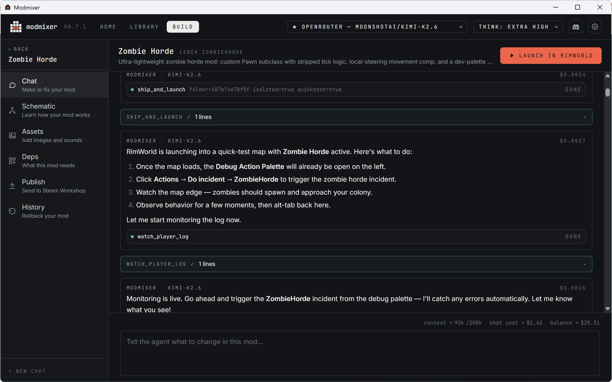

 

[modmixer.com](https://modmixer.com)

---

Build RimWorld mods without writing code.

Modmixer is a desktop app that lets you describe a mod in plain English and
have an AI agent build it for you. You chat, it edits the XML and C# files
in your Mods folder, manages your art and audio assets, launches the game
to test, watches the logs for errors, and helps you publish to the Steam
Workshop when you're happy.

Mods aren't just code. Modmixer also helps you import sprites, textures,
and audio, and lays them out inside your mod folder the way RimWorld
expects.

It's also useful if you do write code — the agent does the boring parts
(scaffolding, def-graph lookups, log triage) so you can focus on the
interesting design decisions.

## Getting started

1. Install Modmixer from [modmixer.com](https://modmixer.com).
2. Run Modmixer. It walks you through setup, including connecting an AI
   model. Modmixer needs a model such as ChatGPT or Claude to build your
   mods. See [Choosing an AI Provider](https://modmixer.com/docs).
3. Once you're set up, read on.

## Building your first mod

### Create a new project

1. Launch Modmixer
2. From the Home screen click "+ New Mod"

Once your new project opens, Modmixer starts the conversation.

### Chat with Modmixer

Chat is the heart of Modmixer. Building a mod is a lot like talking to
ChatGPT, except Modmixer can also write code and control RimWorld to help
you build and test mods.

When you first create a mod, Modmixer will ask you "What's your mod idea?".
Your answer to this can be something simple, like "Add a new type of sword
to RimWorld". Modmixer will ask questions about your idea until it has
enough detail to turn it into a working mod. It will usually present a plan
for you to approve before moving forward. Read it carefully and check you're
happy with everything before saying yes. The next step takes a few minutes,
so it's better to get the plan right from the start.

### Watch Modmixer build your mod

After you approve the plan, Modmixer gets to work building your mod! Usually
this takes a few minutes. During this time you'll see a message in the chat
every time Modmixer reads a file or writes some code. All of this is
automatic and you don't need to do anything. It's ok if these messages look
a bit confusing. You'll start to understand what they mean as you get more
experienced with Modmixer.

Just like a person, sometimes Modmixer makes a mistake, and you'll see it
try to recover. This is a normal part of the process and nothing to worry
about.

Eventually Modmixer will finish, and ask if you're ready to test. When you
say "yes", it will automatically launch RimWorld, with your new mod
installed. It's time to test!

### Test your mod

Testing is the most important part of building a mod. Modmixer can write
code, it can fix bugs, it can even launch your mod in RimWorld, but it can't
test it. Only you can check the mod does what it's supposed to. When you're
testing you might find:

- It doesn't do exactly what you imagined
- It works but you have an idea to make it even better
- It has a bug
- RimWorld is running slower

Come back to the Modmixer chat and explain the issue or what you want to
change. Just like before, Modmixer will work for a few minutes to make
changes, and eventually ask you to retest.

Modmixer also monitors RimWorld for errors while you're testing. It does
this using a special "Modmixer Bridge" mod (so don't be concerned if you see
this in the modlist). When Modmixer detects an error, it will send you a
notification and start fixing it automatically. When it's done it will ask
if it can relaunch RimWorld for you.

### Keep building

At this point you've built a mod with chat, tested it, and made changes.
This is how you'll spend the vast majority of your time in Modmixer. As you
get more experienced you'll learn how to talk to Modmixer to get even better
results.

When you're ready to share your mod on Steam Workshop, head over to
[Publishing Your Mod](https://modmixer.com/docs).

## Learn more

Full documentation lives at [modmixer.com/docs](https://modmixer.com/docs),
including:

- Choosing an AI provider
- Adding images & sounds
- Publishing your mod
- Adding dependencies & mod compatibility
- Pro tips and FAQ

## License

MIT. See [`LICENSE`](LICENSE) and [`NOTICE`](NOTICE) for third-party
attribution.
